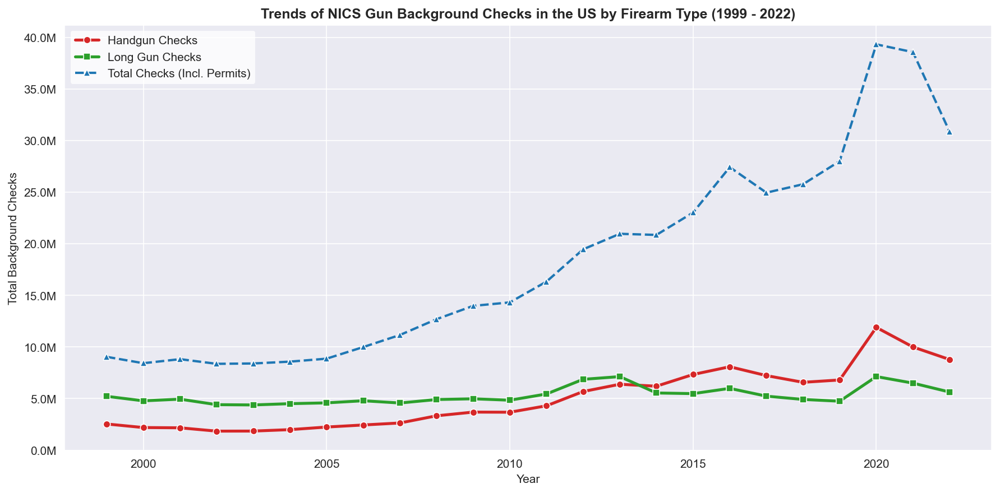
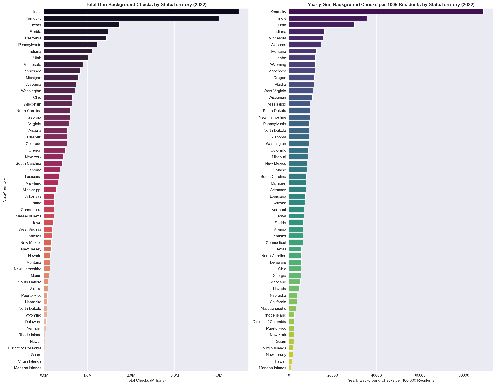
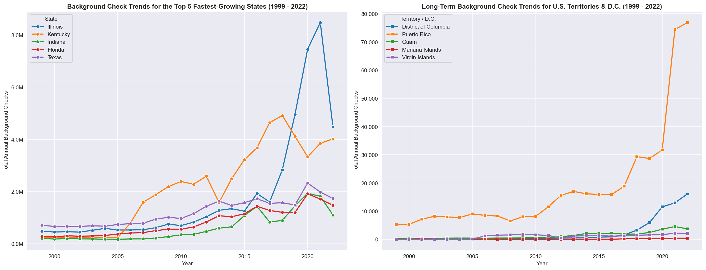
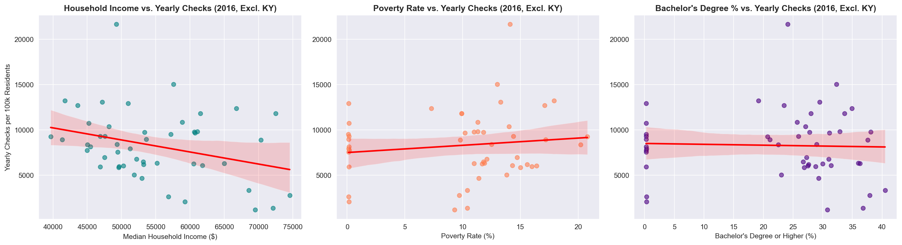

# FBI NICS Gun Background Checks vs. US Census Data Analysis

This repository contains a comprehensive data analysis project investigating the trends of firearm background checks in the United States and their correlation with socioeconomic indicators. The project integrates state-level monthly background checks from the FBI's National Instant Criminal Background Check System (NICS) with demographic and economic statistics from the U.S. Census Bureau.

---

## 📋 Table of Contents
1. [Project Overview](#-project-overview)
2. [Datasets Used](#-datasets-used)
3. [Research Questions & Visualizations](#-research-questions--visualizations)
   - [Question 1: National Trends over Time](#question-1-national-trends-over-time)
   - [Question 2: State Comparison (Volume vs. Per-Capita Rate)](#question-2-state-comparison-volume-vs-per-capita-rate)
   - [Question 3: Long-Term Growth of States & U.S. Territories](#question-3-long-term-growth-of-states--us-territories)
   - [Question 4: Socioeconomic Correlations](#question-4-socioeconomic-correlations)
4. [Key Findings & Conclusions](#-key-findings--conclusions)
5. [Limitations](#-limitations)
6. [Getting Started](#-getting-started)

---

## 🔍 Project Overview

Firearm background checks are widely used in policy research as a proxy for gun purchase demand. This project wrangles, cleans, and merges FBI NICS records (1999–2023) with U.S. Census metrics to uncover geographic distribution, historical trends, and potential socioeconomic predictors of gun checks.

---

## 📊 Datasets Used

1. **FBI NICS Gun Background Check Data (`nics-data-09-2023.csv`)**: Monthly counts of background checks by state and transaction type (permit, handgun, long gun, etc.).
2. **U.S. Census Data (`us_census_data.csv`)**: State-level socioeconomic metrics covering population, income, poverty, and education.
3. **U.S. Population Data 2020–2023 (`us_population_2020_2023.csv`)**: A compiled dataset combining U.S. Census estimates with World Bank population data to cover all 50 states, Washington D.C., and all U.S. territories.

---

## 📈 Research Questions & Visualizations

### Question 1: National Trends over Time
*What is the overall trend of gun background checks over time (1999 to 2022) in the United States, and how do handgun vs. long gun trends compare?*

* **Total Volume:** Gun background checks have seen a steady, long-term upward trend since 1999, peaking dramatically during the social and political events of 2020 and 2021.
* **Handguns vs. Long Guns:** Long gun checks show a highly seasonal, cyclical pattern (peaking during autumn hunting seasons). Handgun checks, conversely, have grown consistently year-over-year. Around 2012, handgun checks surpassed long gun checks nationally and have maintained their lead since.



---

### Question 2: State Comparison (Volume vs. Per-Capita Rate)
*Which states/territories have the highest and lowest gun checks (both in raw totals and per capita) in 2022, and how do they compare?*

* **Raw Volume:** Populous states like Texas, Florida, California, and Pennsylvania dominate the total number of background checks.
* **Per-Capita Rate:** When adjusted per 100,000 residents, Kentucky represents an extreme administrative outlier. Kentucky runs monthly rechecks on all concealed carry permit holders, inflating their counts. Outside of Kentucky, states like Illinois, Utah, and Alabama show exceptionally high per-capita background check rates. U.S. territories (e.g., Virgin Islands, American Samoa) and Washington D.C. have the lowest volume and per-capita rates.



---

### Question 3: Long-Term Growth of States & U.S. Territories
*Which states have the fastest-growing trends in background checks over the 1999–2022 period, and how do U.S. territories compare?*

* **Fastest Growing States:** States like Illinois, Kentucky, Utah, and Alabama show exponential growth trends over the 24-year period.
* **Territories & D.C.:** U.S. territories experience virtually flat and negligible activity. Guam shows minor activity, while the Northern Mariana Islands and Virgin Islands have almost zero. Washington D.C. has a slow but steady increase, though it remains extremely low overall.



---

### Question 4: Socioeconomic Correlations
*How do socioeconomic factors (median income, poverty rate, and education level) correlate with per-capita background checks across states in 2016?*

To avoid scaling distortion from administrative outliers, Kentucky was excluded from this correlation analysis.

* **Median Household Income:** Shows a moderate negative correlation ($r = -0.31$, statistically significant at $p < 0.05$), indicating that states with lower median household incomes generally exhibit higher per-capita gun checks.
* **Poverty Rate:** Exhibits a weak, non-significant positive correlation ($r = 0.13$).
* **Education Level:** Displays a weak, non-significant negative correlation ($r = -0.19$).



---

## 🏆 Key Findings & Conclusions

1. **Firearm Demand Growth:** Gun background checks have steadily increased over the last two decades, driven primarily by a surge in handgun purchases and permit renewals rather than long guns.
2. **Administrative Bias:** Per-capita analysis is heavily impacted by state-level legislation (e.g., Kentucky's monthly permit rechecks or Illinois's FOID card system), meaning NICS totals reflect legal frameworks as much as consumer demand.
3. **Socioeconomic Link:** Lower median household income has a statistically significant correlation with higher rates of gun checks per capita, whereas poverty and college-education rates show weaker, statistically insignificant relationships.

---

## ⚠️ Limitations

1. **Checks $\neq$ Sales:** The NICS system tracks background checks, not actual firearm transactions. One background check can result in multiple firearm purchases, and private sales/permit-exempt purchases are often underrepresented.
2. **Census Transposition:** The raw U.S. Census dataset requires extensive transposition and type-casting (removing formatting characters like `$`, `%`, and commas) to become machine-readable.
3. **Temporal Alignment:** Census demographic variables are static estimates from specific years (e.g., 2016), whereas NICS checks are continuous monthly data, requiring careful filtering to align temporally.

---

## 🚀 Getting Started

To explore the analysis and run the notebook locally:

### 1. Prerequisites
Ensure you have Python 3.10+ installed.

### 2. Set up the Environment
Activate the virtual environment and launch Jupyter:
```bash
# Activate virtual environment
source .venv/bin/activate

# Launch Jupyter Lab or Notebook
jupyter lab
```

### 3. Notebook Structure
Open and execute the cells in [Investigate_a_Dataset.ipynb](file:///Users/luis/Documents/projects/data-analysis-nics/Investigate_a_Dataset.ipynb). To export to HTML:
```bash
jupyter nbconvert --to html Investigate_a_Dataset.ipynb
```
